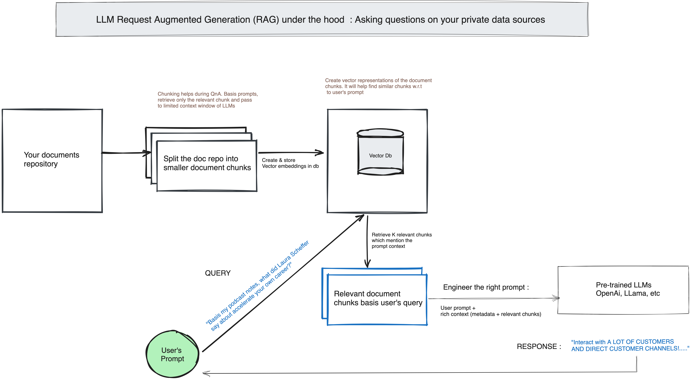

## Asking LLMs to answer questions based on your private data soureces using Request Augmented Generation (RAG) technique.

### Why Request Augmented Generation (RAG)? 
Suppose you have your data repository (example - Notion Notes) and you want to be able QnA using prompts. Base (pre-trained) Large Language Models are only aware of the information they are pre-trained on. Base LLM's answers to prompts based on your private data will fall short or even hallucinate.

### What is Request Augmented Generation (RAG)? 
Request Augmented Generation (RAG) fetches relevant information basis your prompt from your data source and enhances the input prompt to LLM, providing richer context to improve LLM ouput. It combines the power of existing Information Retrieval techniques and LLMs by fetching relevant documents from your provided data repository and augment the final prompt to base LLM to improve factuality in LLM answers and reduce hallucination.

### How it works?

## QnA bot over your Notion Database using RAG technique & OpenAI LLM
As highlighted in the above diagram we will do the following steps : 

1. Load the Notion database using Langchain Notion Document Loader
2. Split the loaded Notion Documents into semantically relevant chunks
3. Create vecttor embeddings of chunks & store them into a vector database (Pinecone)
4. Basis user's prompt, retrieve the semantically relevant chunk from the vector data
5. Create a prompt template using user's prompt + retrieved documents + any other metadata and pass it to base LLM (in our case OpenAI) to retrieve the right answers

## Pre-requisites 
1. Have OpenAI API Key. Refer : [OpenAI API Keys](https://platform.openai.com/account/api-keys)
2. Set OPENAI_API_KEY as the environment variable
3. Download your Notion documents in markdown format, unzip it and put the file in your repo with name "Notion_db" : [Export Notion Db](https://www.notion.so/help/export-your-content)

Note : While we are using Notion docs as an example, you can use any database but you have to appropriately make changes in every step i.e. data loaders, chunking parameters, retrieval methods, etc. Most of it would be straightforward using Langchain documents.

### Step 1 : Load the Notion Database
1. Refer to the file `dataloader.py`
2. We are using Langchain's NotionDirectoryLoader and providing the db directory path from our repo
3. We print the number of Notion documents loaded

### Step 2 : Split loaded documents in semantically relevant chunks
1. Refer to the file `document_chunks.py`
2. Why are we splitting the docs into chunks? Our ultimate objective is to be able to retrieve semantically relevant document portions/chunks basis user's query. Therefore, quality of chunk greatly impacts the end outcome.
4. Chunking can be on the basis of following splitters : Characters, Tokens, or context aware splitting used for structured data like Markdown.
5. Different parameters to experiment with 
6. Parameter needed to be experimented with : Splitter, chunk size, chunk overlap, and length function.
7. I experimented with different splitters & chunk_sizes on my test prompts and finally chose character splitter with chunk size of 1024.
8. How do you evaluate quality of these chunks objectively without relying on experimentation with values? Good question! And I am still finding answers for. If you have suggestions or comments reach out to me [Neeraj@Twitter](https://twitter.com/kn_neeraj)
9. Finally, we test the chunking logic by printing the number of chunks created and printing the 1st chunk content & metadata

Fantastic! Now that we have chunks created, we need to create vector embeddings of each chunk and store them in our vector db. Using these vectors we will find semantically relevant chunks from user's query and retrieve them from the database.    

### Step 3 : Create embeddings & persist them in the vector database
1. Refer to file : `document_embedings.py`
2. We are using OpenAIEmbeddings module for creating embedding & Pinecone as vector database to save embeddings.
3. Create embeddings and persist the DB so that it can be used later.
4. Finally, we test it using our test prompts in `test_data.py` file. You can manually check if it is able to retrieve semantically relevant document chunks basis your test prompt.
5. Validate : You have to try different prompts and see if the current system is able to retrieve relevant chunks or not. If not, continue to refine document spltter built in the previous Step.

